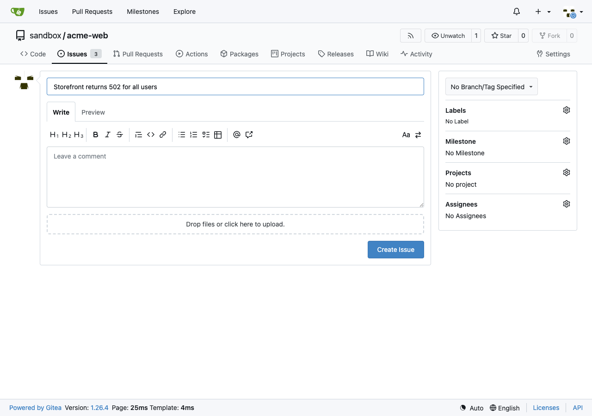
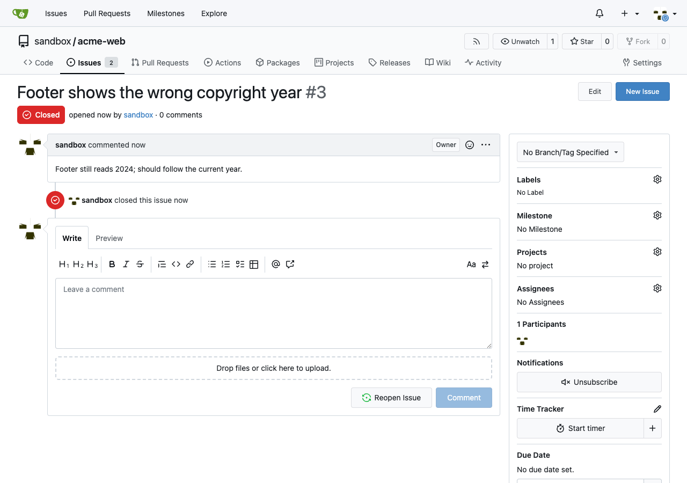

# agent-sandbox

An **RL-training sandbox built around a real, third-party application** — the actual
job of integrating software into something like Mercor's RL Studio. It takes
[Gitea](https://about.gitea.com/) (a real, self-hosted GitHub-style app that was
never designed to be agent-driven or resettable), runs it, and makes it operable by
an agent **two ways**:

1. a **FastMCP server** exposing Gitea's actions as MCP tools, and
2. a **Browser-Use Agent (BUA)** that operates Gitea's real web UI in a live browser,

with **populate / snapshot / restore** hooks that reset the app to a deterministic
state between episodes — including a snapshot/restore that swaps Gitea's *real on-disk
state* (its SQLite database + git repositories), because a real app gives you no reset
button.

This mirrors the three-step method for building an RL environment: **(1)** a realistic
world (a seeded Gitea with repos + issues), **(2)** the tools/apps the agent interacts
with (the MCP server + the browser), **(3)** rigorous tasks + verifiers that grade the
app's real state.

```
                       ┌─────────────────────────── grades ──────────────────────────┐
                       │                                                              ▼
  ┌───────────┐   MCP tools    ┌──────────────┐                              ┌──────────────┐
  │  agent /  │───────────────▶│ FastMCP      │──REST──▶┌───────────────┐    │  verifier    │
  │  policy   │                │ server       │         │  Gitea        │    │ (tasks.py)   │
  │           │  browser acts  ├──────────────┤         │  real OSS app │◀───│ reads real   │
  │           │───────────────▶│ Browser-Use  │──UI────▶│  SQLite+repos │    │ state        │
  └───────────┘  click/type    │ Agent (BUA)  │         └──────┬────────┘    └──────────────┘
                               └──────────────┘                │
                                             populate / snapshot / restore
```

## Why this is the real problem

Wrapping an app *you wrote* is easy — you can add a clean `/reset` endpoint. The actual
integration skill is handling an app you **don't control**:

- **No reset endpoint.** Two strategies live in `state.py`, and choosing between them is
  the real judgment call. `populate` rebuilds a known world through Gitea's **own API**
  (fast, no restart — for per-episode resets). `snapshot`/`restore` operate on the
  **on-disk state** — SQLite (copied via the online-backup API) plus the git
  repositories directory — which is the fallback when an app exposes no reset, and the
  way to rewind to an *arbitrary* checkpoint. `restore` stops the app, swaps both, and
  restarts it, because you cannot swap files under a live process; the harness therefore
  **owns the app's lifecycle**.
- **A real, messy UI.** The BUA drives Gitea's actual pages — logging in, navigating,
  filling the new-issue form, clicking *Create Issue*. Gitea re-renders parts of the DOM
  with client-side JS after load, so the agent **re-reads the page and re-resolves
  elements right before acting** (a genuine BUA robustness concern, handled here).
- **Grade the outcome, not the transcript.** Verifiers query Gitea's real API afterward
  and return a reward — they don't care whether the agent used MCP or the browser.

## Layout

| Path | Role |
|---|---|
| `sandbox/app_process.py` | Owns the Gitea process — start / wait-ready / stop, so state can be swapped safely. |
| `sandbox/gitea_client.py` | REST client (repos, issues) — the surface MCP tools + verifiers use. |
| `sandbox/state.py` | **populate** (API reseed) + **snapshot / restore** (real on-disk db+repos). |
| `sandbox/mcp_server.py` | **FastMCP server** — Gitea actions as MCP tools + resources + lifecycle tools. |
| `sandbox/browser_agent.py` | **The BUA** — action space (navigate/observe/click/type), observation, episode loop, and pluggable ScriptedPolicy / LLMPolicy. |
| `sandbox/seed.py` | Seeds the deterministic baseline "world" and captures it as a snapshot. |
| `sandbox/tasks.py` | RL-style tasks + **verifiers** (autograders). |
| `tests/` | pytest against a live Gitea + real Chromium — client, state hooks, MCP tools, and the BUA solving tasks. |
| `scripts/` | `start_app.sh` (fetch + configure + boot Gitea reproducibly), `demo_bua.py`, `stop_app.sh`. |

## Quickstart

```bash
uv venv --python 3.12 && source .venv/bin/activate
uv pip install -e ".[dev]"

./scripts/start_app.sh          # download + boot Gitea, mint an API token
python -m sandbox.seed          # seed the baseline world + snapshot it

pytest -q                       # run everything against the live app + a real browser
python scripts/demo_bua.py file-outage-bug   # watch the BUA file a bug, then get graded
```

## The two control planes

**MCP (tool-based).** `python -m sandbox.mcp_server` (stdio) or
`MCP_TRANSPORT=http python -m sandbox.mcp_server` (HTTP :9100). Tools: `create_repo`,
`list_repos`, `create_issue`, `list_issues`, `comment_issue`, `close_issue`,
`populate`, `snapshot`, `restore`. Resources: `repos://all`, `issues://{repo}`.

**Browser (UI-based).** The BUA in `browser_agent.py`:

- **Action space:** `navigate`, `observe`, `click(ref)`, `type(ref, text)`.
- **Observation:** the visible interactive elements, each with a stable ref and a label
  (an accessibility-tree-style view, not raw HTML) — what the policy reasons over.
- **Loop:** perceive → decide → act until the policy signals done or a step budget runs out.
- **Policies:** `ScriptedPolicy` (deterministic, no API key — used by the tests and the
  demo) and `LLMPolicy` (a real model picks the next action from the observation; set
  `GEMINI_API_KEY` to enable). The loop, action space, and observation are identical —
  only the decision-maker changes.

## Tasks & verifiers

Defined in `tasks.py` against the baseline world:

- **`file-outage-bug`** — file a new issue on `acme-web` with an exact title. Verifier:
  an open issue with that title exists.
- **`close-fixed-typo`** — close the footer-typo issue. Verifier: that issue is `closed`.

An episode runner: `populate()` → hand the task to an agent (MCP or BUA) → `verify()` →
`restore()` to branch the next rollout.

## The browser agent, working

The BUA logs in, navigates, fills the new-issue form, and submits — operating Gitea's
real UI, then graded by the verifier (`python scripts/demo_bua.py file-outage-bug`):



And closing an issue (`close-fixed-typo`) — issue #3 shows the red **Closed** badge and
"sandbox closed this issue":



## Notes

- The Gitea binary and its runtime state live under `vendor/` and are **gitignored** —
  `scripts/start_app.sh` regenerates them. No secrets are committed; the API token is
  read from the environment or a gitignored file.
- Tested with Gitea 1.26, Python 3.12, FastMCP, Playwright (Chromium). Swap Gitea for
  any real app: point the client at its API, drive its UI, and implement the state hooks
  against *its* persistence — the tools, tasks, and BUA machinery don't change.

MIT.
